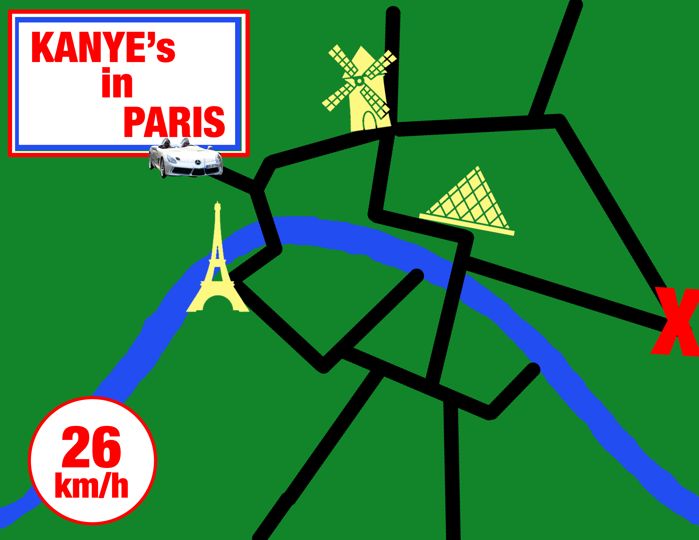
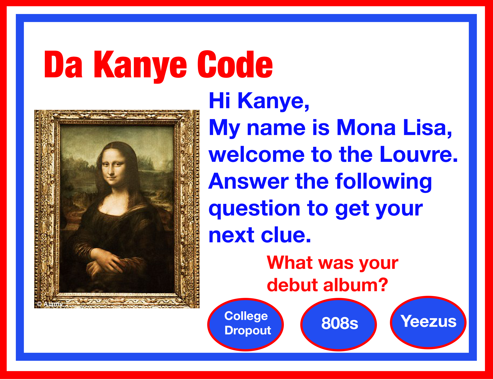

# Kanye's In Paris
## By Adam Kercheval, Will Mairs, and Avery Spratt (Team 6)

Oh no! You're Kanye west, and you've just learned, mid-world tour, that the love of your life,
Kim K., has been robbed at gunpoint in Paris! You're (obviously) wildin' the f*ck out [(goin' Bobby Boucher,
one might say)](https://genius.com/1781251), and you decide to hop on a plane to De Gaulle A$AP.

Once you get to Paris, though, aside from going gorillas, you've got to drive around the city to find the clues to solve the crime.

Drive from point to point in the City of Love, solving the Crime of the Century,
before time runs out! But remember, [Drive Slow, Homie](https://genius.com/Kanye-west-drive-slow-lyrics)!
Parisian detectives are no good, but their traffic cops are the best around.
If you get arrested for speeding, you lose time!

### Problem Statement:
Kim has been robbed, and you have to find out who did it!

### How do you solve the problem?
Interactively drive around a map of Paris from point to point to collect clues, being careful
that you don't exceed the speed limit and get arrested.

### Features:
* Client-side data persistence, to store clues that have already been found and past scores
* Push notifications to inform the player of where to go to find the next clue, or when they
have been arrested for speeding
* Reporting data at the end of the game in charts and graphs (average speed, time spent
    searching, number of arrests, etc.)

### We may include:
* Front-end framework like bootstrap to display the board and clues side-by-side, and to show
the data at the end of the game
* Geolocation, if we want to get fancy and put the user on an actual map of Paris

### Notes:
We're planning on using an HTML canvas element to store the game, based off the code found
[here](http://ucfcdl.github.io/html5-tutorial/) (some preliminary code for which is already in this repo as
index.html, script.js, and style.css). We'lll change the car icon and the background,
and we'll use the coordinates that the car is at on the canvas to keep track of whether the player is on the road and
has reached the necessary location. We'll also change the speed element so that when you press
the up arrow (or 'W', whatever it may be) the car doesn't just move forward - its speed also
increases.
A soundtrack for the game (tentatively) will be Kanye saying "drive slow" on a repeating loop
from [this song](https://www.youtube.com/watch?v=RxNdSDraYOU).
### Some additional thank-yous:
#### For canvas color (to determine roads):
[Stack overflow](http://stackoverflow.com/questions/6735470/get-pixel-color-from-canvas-on-mouseover)!

# Comments by Ming
* Total win just on the title *and* the reference to the legendary Bobby Boucher alone.

## Final Notes
Man, what a project. We had quite a fun time implementing [gorgeous](https://open.spotify.com/track/23SZWX2IaDnxmhFsSLvkG2) game, and we hope you enjoy it as much as we do!
### Fun things we learned:
1. Client-side data persistence:
Since we redirect to other web pages to show Kanye's clues at each stop, we needed to store data
inside the game about Kanye's position and the time remaining, so that when the game page reloaded,
the player didn't start at the beginning again. We used session storage to do this, meaning
as long as the player keeps the browser session running, all of their data will remain.
We also had to impelemnt some way of storing each player's high scores. This information
was stored using local storage, so that the user can close the browser, load the game at another
time, and the data will still persist.

2. CORS and using someone else's server:
The background image and car on which Kanye drives are images, which are loaded onto an HTML canvas.
In order to tell whether Kanye is on the road, we needed to analyze what color the picture was at Kanye's
current x and y coordinate. Long story short, doing that isn't so easy. Loading the image into
the canvas and just pulling the data off of it using getImageData doesn't work, because technically
the image's source is from a cross-origin location, and getting data from a cross-origin location
is a no-no! Here's how we worked around it:
We found a CORS-friendly data hosting site (thanks to some Google searches), namely, Dropbox,
and put all of our images on there, instead of on our own server. From there, we created links
to access the content. Then, every time we needed to get the data of a certain pixel on
the image, we requested to Dropbox with a parameter "crossOrigin" set to "Anonymous".
Because of the way Dropbox accepts requests, if you make the request with this Anonymous
cross-origin parameter, you can get your data free of CORS errors! It's magical. This took a lot
of stackoverflow searching to find.

3. The HTML canvas element:
It's awesome! Let me break down for you exactly how it works. You set up a "canvas" element
in your HTML file that you reference in your .js file or files. This provides you with a rectangle
of any width and height that you specify. On that canvas, you can "draw" any image or shape you like,
in any position you like. How, you might ask, do you animate with it? How does Kanye drive?
The answer: a loop that re-draws everything every 30 milliseconds. In that loop, the map is
always drawn in the same position, but the car is redrawn at updated x and y coordinates, which change
based on the player's interaction with the arrow keys. It's a little complex once you get down into
the specifics, but that's the basic idea.

That's all there is to print! We hope you enjoy the game!
